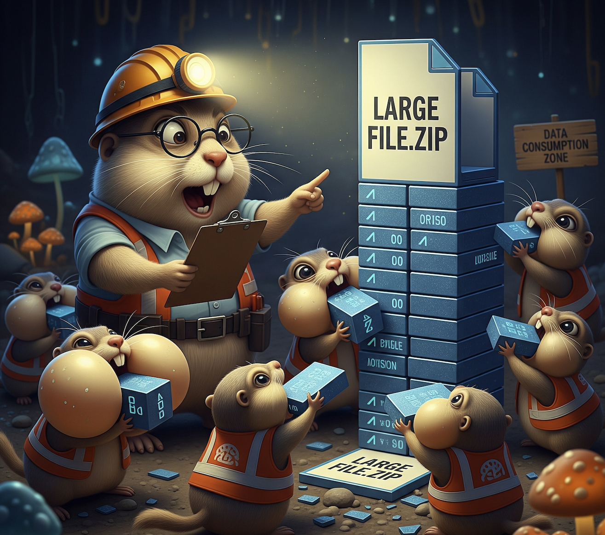

# Gobble: A **super-fast, easy-to-use file downloader** written in Go.
Think of it as a smarter version of `wget` or `curl` designed for modern high-bandwidth networks.

---

## 🚀 Features

---

## 🔧 Getting Started

### Clone and build

### Run

---

## 🛠 Roadmap

---

## 🤝 Contributing

---